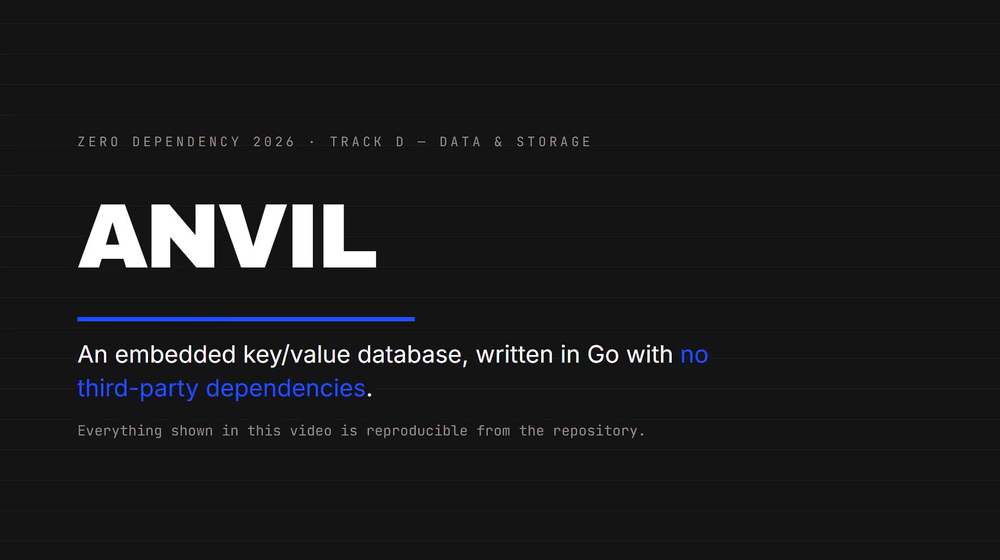
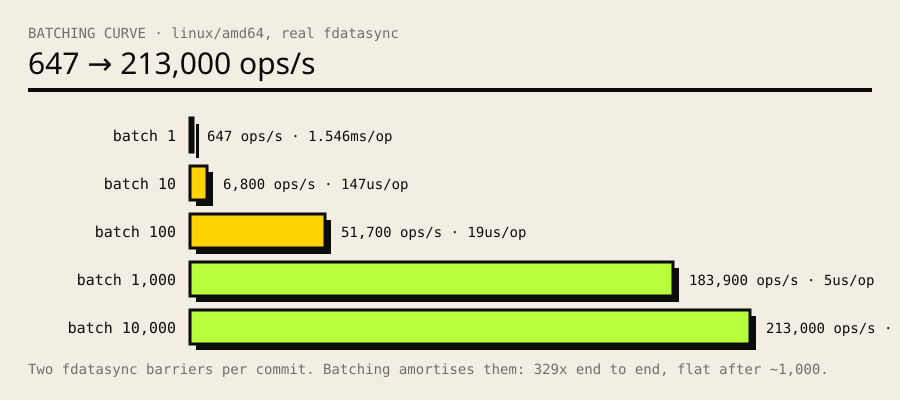
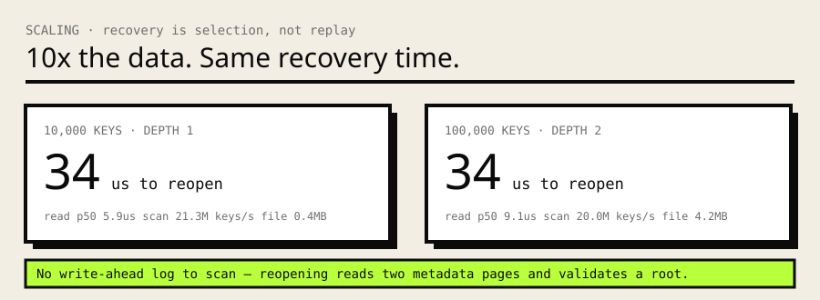
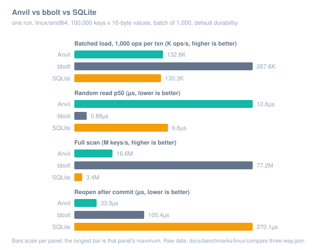

# Anvil

**A crash-consistent embedded key/value database built entirely from the Go
standard library, and proven by destruction.**

[](https://github.com/harshtripathi272/anvil/actions/workflows/ci.yml)
[](STDLIB.md)
[](https://go.dev)
[](LICENSE)

[](https://youtu.be/FmUbg7NCIro)

**[Watch the demo](https://youtu.be/FmUbg7NCIro)** (2:37). Shot list in
[docs/DEMO.md](docs/DEMO.md), narration and recording notes in
[docs/VIDEO-SCRIPT.md](docs/VIDEO-SCRIPT.md). Every claim in the video
reproduces with `./scripts/verify.sh`.

Anvil is a transactional storage engine you link into your program: no server,
no daemon, no driver, no dependencies. Data lives in a copy-on-write B+tree
over a single file. Kill the process at the most dangerous moment of a commit
and the file still opens, with every acknowledged transaction intact.

Copy-on-write B+trees are established design (LMDB, bbolt). What Anvil adds is
**calibrated proof**: a harness that crashes the engine at every seam of its
commit protocol and verifies recovery against an independent model, plus a
*negative control* that removes a durability barrier and confirms the harness
catches the failure.

> We defined a failure model in which only synchronized bytes survive, then
> exhaustively exercised the defined persistence seams and verified that every
> acknowledged transaction recovered to a valid committed state.

## Zero dependencies

```console
$ cat go.mod
module github.com/harshtripathi272/anvil
go 1.27                                     # no require block

$ go list -m all
github.com/harshtripathi272/anvil           # no third-party modules

$ CGO_ENABLED=0 go build ./...              # one command, static, no cgo
```

Anvil replaces an embedded-database dependency such as bbolt, LMDB, BadgerDB,
or SQLite, several of which drag in cgo and a C toolchain. All 14 substitutions
are itemized in **[STDLIB.md](STDLIB.md)**.

## Quickstart

```console
$ go build -o anvil ./cli

$ ./anvil create data.anvil
$ ./anvil put   data.anvil user:1 lakshya
$ ./anvil put   data.anvil user:2 harsh
$ ./anvil get   data.anvil user:1
lakshya
$ ./anvil scan  data.anvil user:
user:1	lakshya
user:2	harsh
(2 keys)
$ ./anvil check data.anvil
  RESULT: PASS
```

## One CLI

Everything, the database and its proof, is behind a single command.

```console
$ anvil --help

database:
  create    <db>                 create an empty database
  put       <db> <key> <value>   write a key/value pair
  get       <db> <key>           read a value
  delete    <db> <key>           delete a key
  scan      <db> [prefix]        list keys in order
  info      <db>                 show generation, root page, size
  check     <db>                 verify structural invariants

verification:
  verify    [flags]              run the complete verification suite
  torture   [flags]              crash the engine at every commit seam

benchmark:
  bench     [flags]              measure write, read, scan and recovery
```

`anvil verify` runs the whole evidence set in one shot: model equivalence,
concurrency, crash torture, the negative control, and a real process kill.

```console
$ anvil verify

  PASS  model equivalence    40000 operations, 350 keys, 0 mismatches
  PASS  concurrency          3000 commits, 8 readers, 1934 snapshots, 0 partial reads
  PASS  crash torture        100000 crashes across 9 seams, 0 lost, 0 violations
  PASS  negative control     durability violation correctly detected
  PASS  process kill         killed at generation 1308; 1307 acknowledged keys intact

  RESULT: PASS
```

The fourth line is the one that matters. A crash test that only kills processes
would pass even with every `fsync` deleted, because the page cache serves the
data back. So the harness is calibrated: remove a required durability barrier
and it must fail.

```console
$ anvil torture --negative-control
  RESULT: FAIL
    recovery open failed: anvil: database corrupt

  EXPECTED FAILURE: the verifier caught the resulting data loss. The test has teeth.
```

## Library API

```go
import "github.com/harshtripathi272/anvil/engine"

db, err := engine.Open("data.anvil")
if err != nil {
	return err
}
defer db.Close()

// Single operations, each its own transaction.
db.Put([]byte("name"), []byte("lakshya"))
v, err := db.Get([]byte("name"))
db.Delete([]byte("name"))

// Atomic multi-key transaction: all of it, or none of it.
tx, err := db.BeginWrite()
tx.Put([]byte("account:A"), []byte("900"))
tx.Put([]byte("account:B"), []byte("100"))
err = tx.Commit()

// Snapshot read: a stable view, unaffected by concurrent commits.
rtx, err := db.BeginRead()
defer rtx.Close()
for it := rtx.Scan([]byte("account:"), []byte("account:~")); it.Next(); {
	fmt.Printf("%s = %s\n", it.Key(), it.Value())
}
```

Keys and values are arbitrary bytes. The storage layer makes no UTF-8
assumptions anywhere.

## How it works, in six lines

A write clones the root-to-leaf path into fresh pages instead of modifying
committed ones, then publishes a new root. Two alternating metadata pages carry
a generation number and a checksum. The commit protocol is:

```
write new pages → fdatasync → write meta (alternate slot) → fdatasync → ACK
```

Data is durable before the metadata that references it; the second sync is the
commit point. Recovery picks the newest metadata generation that validates.
There is no write-ahead log and nothing to replay.

```
                    application / CLI
                            │
                      Anvil API
                            │
              ┌─────────────┴─────────────┐
        read transaction            write transaction
        (snapshot root)              (single writer)
              └─────────────┬─────────────┘
                            │
                   copy-on-write B+tree
                            │
                    page encode / decode
                            │
                      Storage interface
                            │
              ┌─────────────┴─────────────┐
         FileStorage                 FaultStorage
      (real file, fdatasync)   (only synced bytes survive)
```

Full detail: **[docs/ARCHITECTURE.md](docs/ARCHITECTURE.md)**.

## What it guarantees

Anvil is **crash-consistent under a documented storage and failure model**:

- **Simulated power loss** (only `fsync`'d bytes survive): every acknowledged
  transaction recovers to a valid committed state, across all nine commit seams.
  100,000 cycles, zero losses, zero invariant violations.
- **Real process kill** (`SIGKILL`): recovers cleanly on a real file, verified
  end to end. This proves *consistency*; durability is proven by the fault
  backend above.
- **Real hardware power loss**, or storage firmware that lies about flushes:
  **not claimed.**

Anvil does not claim to be "crash-safe" unqualified, to never lose data, to be
mathematically proven, or to be faster than any production database.

## Benchmarks

Performance is not a competition claim. The commit path is fsync-bound by
design (two durability barriers per commit, roughly 8x slower on ext4 than on
Windows, and the ext4 number is the one to trust). These charts exist to show
where a from-scratch engine sits next to mature ones. Where Anvil loses, the
reason is stated. Full evidence: **[docs/BENCHMARKS.md](docs/BENCHMARKS.md)**,
raw runs in [docs/benchmarks/](docs/benchmarks/).

### Batch your writes

One pair of durability barriers is shared by every operation in a transaction,
so throughput is a function of batch size:



**329x between a batch of 1 (647 ops/s) and a batch of 10,000 (213.0 K ops/s)**,
flattening after ~1,000 once fsync stops being the bottleneck. This is the
single most useful thing to know when using Anvil: batch your writes.

### Recovery is constant



Reopening is **34 µs whether the file holds 10,000 keys or 100,000**. Recovery
is generation selection, not log replay: two metadata pages are read, one root
validates, done. Likewise, read cost grows with tree depth, not dataset size
(5.9 µs at depth 1, 9.1 µs at depth 2). That is the B+tree behaving as
advertised.

### Head to head: Anvil, bbolt, SQLite

Same workload, same machine, one run: 100,000 keys x 16-byte values, batch of
1,000, linux/amd64, all three engines at default durability. bbolt is included
because it is Anvil's closest architectural relative; SQLite because it is what
you would otherwise reach for.



| Metric | Anvil | bbolt | SQLite |
|---|---|---|---|
| Batched load (1,000 ops/txn) | 132.8 K ops/s | **267.6 K ops/s** | 130.3 K ops/s |
| Commit p50 | 2.65 ms | **1.28 ms** | 4.63 ms |
| Random read p50 | 12.6 µs | **0.9 µs** | 6.6 µs |
| Full scan | 16.6 M keys/s | **77.2 M keys/s** | 3.4 M keys/s |
| Reopen after commit | **33.9 µs** | 105.4 µs | 270.1 µs |
| File size | 8.7 MB | 16.0 MB | **3.5 MB** |

Reading it honestly:

- **bbolt reads and scans faster** because it memory-maps the file, so a read
  is a pointer dereference into mapped memory. Anvil issues an explicit
  `ReadAt` per page and decodes it, with no cache. That choice keeps the crash
  model simple enough to verify exhaustively, and a page cache is the clearest
  candidate for future work.
- **Anvil opens a file faster than both** and beats SQLite on batched saves and
  scans. There is no write-ahead log to inspect and no freelist structure to
  load.
- **What this does not show:** concurrent throughput, mixed read/write
  workloads, large values, long-running readers. One workload, one machine.

Raw numbers: [docs/benchmarks/linux/compare-three-way.json](docs/benchmarks/linux/compare-three-way.json).
The comparison harness lives outside this repository in its own module, so
bbolt and SQLite are never dependencies of Anvil and `go.mod` stays empty.

## Reproduce everything

```console
$ ./scripts/verify.sh
```

Nine checks: dependency proof, static build, cross-compile, gofmt, vet, the
race test suite, the full verification suite, the negative control, and the
benchmark. Raw evidence lands in `results/`; a committed run is in
[docs/benchmarks/](docs/benchmarks/).

The script owns only what needs the Go toolchain and delegates the rest to
`anvil verify`, so the shell and the CLI can never test different things.

## Repository layout

```
engine/            the storage engine (page format, B+tree, transactions, recovery)
verification/      fault injection, crash torture, model checking, benchmarks
cli/               the single `anvil` command
scripts/verify.sh  canonical reproducibility entry point
docs/              ARCHITECTURE.md, BENCHMARKS.md, DEMO.md, DEMO-VIDEO.md,
                   VIDEO-SCRIPT.md, assets/, benchmarks/, internal/
extra/             auxiliary material, not part of the product
README.md · STDLIB.md · VERIFICATION.md · LICENSE · deps-proof.txt
```

Tests live beside what they test: `engine/` holds the white-box page-format
tests, `verification/` holds everything that exercises the engine from outside.
Verification logic lives in ordinary files (`model.go`, `suite.go`, ...) that
both `go test` and `anvil verify` call, so the two cannot drift apart.

## Limitations (v1)

- Keys ≤ 1 KiB; key + value ≤ ~2 KiB (no overflow pages).
- Single writer, many concurrent readers.
- Grow-only allocation: freed pages are not reused, so the file grows with
  history. Reclamation is deliberately deferred to keep the commit protocol,
  the part that must be correct, small and verifiable.
- No write-ahead log (by design), SQL, secondary indexes, or networking.

## Prior art

Anvil's architecture follows **LMDB** and **bbolt** (shadow-paging copy-on-write
B+tree, double metadata pages, sync-then-publish); **voidDB** is a close Go
relative. No architectural novelty is claimed. The contribution is a
dependency-free from-scratch implementation, plus a verification methodology in
the lineage of **FoundationDB**, **TigerBeetle's VOPR**, and **LazyFS**, applied
to an engine small enough to read in an afternoon.

## License

MIT, see [LICENSE](LICENSE).
